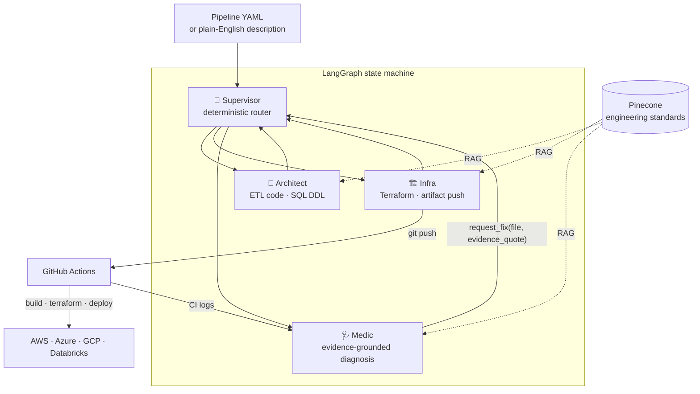

# Multi-Cloud Self-Healing Data Engineer Agent

[](https://github.com/theofanis-tsakanikas/multi-cloud-self-healing-agent/actions/workflows/tests.yml)
[](LICENSE)


An AI orchestration system that **designs, deploys, and repairs production data pipelines end-to-end** — Python ETL, SQL DDL, Terraform, Kubernetes, CI/CD, and observability dashboards — on **AWS, Azure, GCP, and Databricks**, from a single YAML config or a plain-English description.

When a deployment fails, the agent reads the real CI logs, diagnoses the error with quoted evidence, patches the exact file, and redeploys — **without a human in the loop**.

---

## Validated end-to-end

Every cell below is a real pipeline that ran to completion on live cloud infrastructure — chaos-seeded dirty source data in, partitioned clean data + populated dashboards out.

| Cloud | Pipeline | Source → Destination | Compute | Observability | Validated |
|---|---|---|---|---|---|
| 🟠 **AWS** | `eu_sales` | RDS PostgreSQL → S3 (Parquet) | EKS | Trino + Glue · Grafana/Prometheus | ✅ 2026-06-04 |
| 🔵 **Azure** | `us_crm` | Azure PostgreSQL → ADLS Gen2 | AKS | Trino · Grafana/Prometheus | ✅ 2026-06-04 |
| 🟢 **GCP** | `global_marketing` | Cloud SQL MySQL → GCS | GKE | Trino · Grafana/Prometheus | ✅ 2026-06-06 |
| ⚡ **Databricks** | `sales_lakehouse` | RDS PostgreSQL → Delta Lake | Spark (jobs cluster) | Unity Catalog · Lakeview dashboard | ✅ 2026-06-08 |

The three object-storage clouds share one cloud-agnostic execution model (pandas → Parquet → Trino → Grafana on Kubernetes). Databricks is a deliberately distinct fourth model (Spark → Delta → Unity Catalog → Lakeview) selected by the same `provider:` switch — proving the architecture generalizes across genuinely different platforms, not just across vendor APIs.

---

## How it works



**Supervisor** — a deterministic router (the LLM emits exactly one word). Routing invariants live in Python, not in prompt prose.

**Architect** — generates the two judgment artifacts: the pipeline implementation (chunked ETL with real pandas business-rule logic — no stub `is_suspicious = False` — idempotency checks, typed casts, per-rule rejection metrics) and the Trino/Unity Catalog DDL with schema-derived columns. Works phase-gated: Discovery → Schema → Implementation, one tool per phase.

**Infra** — generates the per-cloud pipeline Terraform, then pushes all artifacts and triggers CI. The Kubernetes manifests, Dockerfile and deploy workflow are rendered deterministically from config (see "Where the LLM works" below).

**Medic** — watches the CI run with exponential-backoff polling, then diagnoses failures from a **structured validation summary built in Python** — never by free-form log "interpretation". Its `request_fix` tool *rejects* any diagnosis that doesn't quote a real error marker from the logs, which makes hallucinated fixes structurally impossible. Fixes are surgical patches to the named file only; clean files are off-limits.

### The self-healing loop

1. Chaos-seeded source data or a generated-code defect breaks the CI deploy.
2. Medic fetches the actual GitHub Actions logs and quotes the failing lines as evidence.
3. `request_fix` routes a one-shot `healing_context` to the owning agent (Architect for code, Infra for infra).
4. The agent applies a minimal patch (`patch_project_file` — never a full rewrite), auto-validates, and re-pushes.
5. Medic re-polls. Loop until green or escalation to the user.

### Engineering decisions a reviewer should notice

- **Standards-first generation.** Agents don't improvise conventions — they retrieve versioned engineering standards (`knowledge_base/*.md`, served via Pinecone RAG) covering Terraform, K8s, Spark/Delta, CI/CD, SQL, and dashboards. When output is wrong, the *standard* gets fixed, never the generated file.
- **Where the LLM works vs. where code works — measured, not assumed.** Every artifact was scored by input variability: where the input is open (an arbitrary source schema, business rules in natural language, unpredictable CI failure logs), the LLM does the work — the pipeline script, the SQL DDL, the Terraform, and all diagnosis. Where the structure is fixed (`requirements.txt`, the Grafana/Lakeview dashboards, the Dockerfile, all six K8s manifests, the deploy workflow), deterministic code renders it from config (`agents/codegen.py`), golden-tested against the validated v1.0.0 artifacts. The LLM was *removed* from everything it used to merely copy — an agent that knows where NOT to use the LLM is the difference between an AI system and an expensive template engine. Orchestration is deterministic too: tool sequencing (`tool_choice="required"`, pre-computed args), validation gates, guaranteed injections. No "prompt harder and hope".
- **Validation as a safety net, not a crutch.** `validate_generated_code` enforces policy (credential access only via the sanctioned resolver, no hardcoded regions, no template literals inside K8s manifests) before anything reaches CI.
- **Cloud-agnostic by construction.** No default cloud anywhere — the provider is always read from config, and generated scripts keep the full three-cloud skeleton with only the active branch executing.

---

## Repository map — source vs. generated

A defining property of this repo: **part of it is the agent, part of it is the agent's output**, committed as evidence of what a run produces.

| Path | What it is |
|---|---|
| `agents/`, `graph.py`, `main.py` | The multi-agent system (LangGraph nodes, tools, prompts) |
| `knowledge_base/` | Versioned engineering standards (RAG corpus) |
| `configs/` | Pipeline definitions: objective, source DB, business rules, target infra |
| `bootstrap/` | One-time per-cloud baseline Terraform (EKS/AKS/GKE/Databricks workspace, registries, source DBs, state) |
| `utils/`, `tests/` | Shared libraries + hermetic unit tests (no cloud, no credentials) |
| `streamlit_app.py`, `utils/nlp_parser.py`, `utils/cost_estimator.py` | NL authoring demo: free text → pipeline config, with a 4-cloud cost comparison before deploy |
| **Generated:** `scripts/pipe_*.py`, `k8s/`, `sql/`, `dashboards/`, `terraform/`, `Dockerfile`, `requirements.txt`, `.github/workflows/*_pipeline.yml` | **Agent outputs** — populated by each agent run (the deploy CI consumes them from the repo), fixed only through standards/prompts, never edited by hand |

> Note: the generated paths are empty between runs — each run commits a fresh, coherent set for its target cloud. The complete artifact set from the four validated runs is preserved permanently at the [`v1.0.0` tag](https://github.com/theofanis-tsakanikas/multi-cloud-self-healing-agent/tree/v1.0.0). The root `requirements.txt` (when present) is the *generated pipeline image's* dependency file — the project itself is managed with `uv` via `pyproject.toml` (see [CONTRIBUTING.md](CONTRIBUTING.md)).

---

## Quickstart

Prerequisites: Python 3.12+, [uv](https://docs.astral.sh/uv/), Terraform ≥ 1.6, an OpenAI (or Anthropic / Vertex AI) key, a Pinecone index, and credentials for at least one cloud.

```bash
# 1. Configure
cp .env.example .env          # fill in keys — .env.example documents every variable

# 2. Install
make install                  # uv sync

# 3. One-time cloud baseline (pick your cloud)
make bootstrap-aws            # EKS + RDS + S3 + ECR + SSM

# 4. Sync the engineering standards to Pinecone
make ingest

# 5. Full demo: seed 100 rows of dirty data, then let the agent build & heal
make demo-aws                 # = ingest + chaos + run p=eu_sales
```

Or run any pipeline directly:

```bash
make run p=eu_sales           # AWS
make run p=us_crm             # Azure
make run p=global_marketing   # GCP
make run p=sales_lakehouse    # Databricks
```

Everything is also operable from GitHub Actions (`run_agent.yml` — `workflow_dispatch` with bootstrap / chaos / KB-sync / pipeline inputs), and idle infrastructure can be paused to cut cost (`make aws-pause`, `make azure-pause`, `make gcp-pause`).

### Natural-language authoring (demo UI)

```bash
uv run streamlit run streamlit_app.py
```

Describe a pipeline in plain English → the system extracts a typed intent, proposes business rules, prices the build on all four platforms, and deploys on confirmation.

---

## Observability

Each object-storage pipeline ships with a provisioned Grafana dashboard (record counts, rejection rate, run duration, per-rule rejection breakdown) fed by Prometheus Pushgateway gauges. The Databricks pipeline ships the native equivalent: a Lakeview dashboard over a per-run `_audit` Delta table. Agent runs themselves are traceable in LangSmith.

---

## Testing

```bash
make test     # 190+ hermetic unit tests — no cloud, no credentials, every external dependency mocked
```

CI (`tests.yml`) runs lint + the suite with a coverage floor on every push/PR. The deterministic core (routing, validators, state lifecycle, credential resolution) is unit-tested; the LLM-driven node bodies are validated by the end-to-end pipeline runs above.

---

## Documentation

- [docs/ARCHITECTURE.md](docs/ARCHITECTURE.md) — as-built architecture: agents, state machine, per-cloud execution models, credential resolution
- [docs/VISION.md](docs/VISION.md) — product vision and roadmap
- [SECURITY.md](SECURITY.md) — what is hardened, the deliberate demo trade-offs, and the production posture for each
- [CHANGELOG.md](CHANGELOG.md) — release history
- [CONTRIBUTING.md](CONTRIBUTING.md) — local setup, dependency management
- [CLAUDE.md](CLAUDE.md) — the project's full engineering rulebook (also used by AI coding assistants)

## License

[MIT](LICENSE) © 2026 Theofanis Tsakanikas
